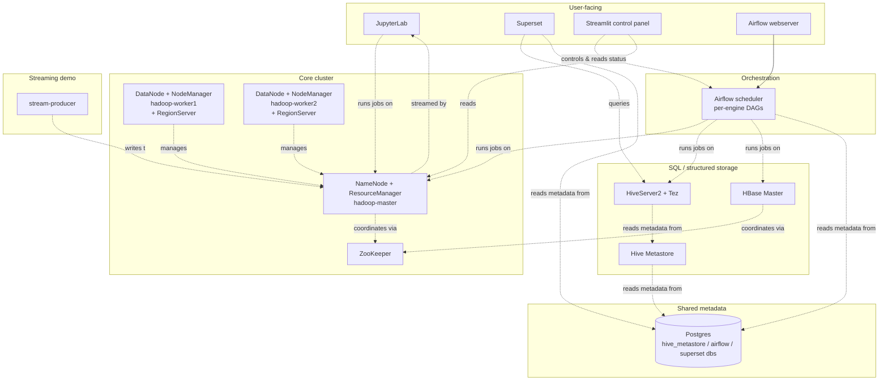

# Modern Hadoop Stack

A from-scratch, genuinely working "classic" Hadoop ecosystem in Docker:
HDFS, YARN, Hive-on-Tez, HBase, Spark, Flink, Airflow, Superset, a
Streamlit control panel, and JupyterLab.

Hadoop isn't competitive with modern data platforms anymore, and this
project doesn't pretend otherwise. The point is the opposite of a toy demo:
every engine here actually runs, actually talks to the others, and the
version pairings are chosen to genuinely work together rather than just
look plausible on paper. It's not tuned for scale or resilience (the
whole YARN cluster has 4GB of scheduling capacity, on purpose), but
nothing here is mocked or faked. When something doesn't work, the fix is
a real fix, not a workaround that hides the problem.

## Architecture



## Component versions

These live as `ARG`s in `docker/hadoop-base/Dockerfile` (and the
per-service Dockerfiles for Airflow/Superset); that's the source of
truth, and this table is just a mirror of it.

| Component | Version |
|---|---|
| Hadoop | 3.4.3 |
| Hive | 4.2.1 |
| Tez | 0.10.5 |
| HBase | 3.0.0 |
| Spark | 3.5.9 |
| Flink | 1.20.5 |
| Airflow | 3.3.2 |
| Superset | 6.1.0 |
| PostgreSQL | 15 |
| JDK | 21 (one version, cluster-wide) |

## How it works

Each engine has its own standalone Airflow DAG (`docker/airflow/dags/`):
`dag_spark.py`, `dag_hive_tez.py`, `dag_hbase.py`, `dag_flink.py`.
`pipeline_dag.py` is the flagship demo: the same wordcount data run
through every engine in one sequential DAG (Spark, then mrjob, then
Hive-on-Tez, then HBase, then Flink). Sequential is deliberate: the
2-worker/4GB-total YARN cluster is too small to usefully run these
concurrently.

The **Streamlit control panel** (`docker/streamlit/`) triggers any of
these DAGs and shows terminal-style job output live, reconstructed from
Airflow's own task logs, not just a green checkmark. It also shows YARN
cluster health and can start/stop the `stream-producer` container.

**Superset** (`docker/superset/`) has one dashboard, "Hive-on-Tez: People",
querying a Hive table over Tez; see the "known limits" note below for why
there isn't a second, HBase-backed dashboard.

**JupyterLab** (`notebooks/demo.ipynb`) runs the same wordcount through
Spark and mrjob side by side, plus Hive and HBase client examples, closing
with a DataFrame comparing both engines' results on identical input.

## Running it

```
docker compose up -d
```

First run takes a while: five of the Hadoop-role services (`hadoop-master`,
`hadoop-worker1/2`, `zookeeper`, `hive-metastore`, `hiveserver2`,
`hbase-master`) share one image tag (`modern-hadoop-base:latest`), so
Compose builds it once and reuses it rather than building it five times
over.

| Service | URL |
|---|---|
| HDFS NameNode UI | http://localhost:9870 |
| YARN ResourceManager UI | http://localhost:8088 |
| HBase Master UI | http://localhost:16010 |
| Airflow | http://localhost:8080 |
| JupyterLab | http://localhost:8888 |
| Streamlit control panel | http://localhost:8501 |
| Superset | http://localhost:8089 (admin/admin) |

`docker compose down` stops everything but keeps all data in named
volumes (HDFS, Postgres, ZooKeeper, ...). `docker compose down -v` wipes
it for a genuinely fresh start.

If you only want part of the stack up (e.g. just Hive, to poke around
with `beeline`), bring up `hadoop-worker1`/`hadoop-worker2` explicitly
too, since HBase's RegionServers and YARN's NodeManagers live there, and
they're not `depends_on`-chained from every other service that needs
them.

